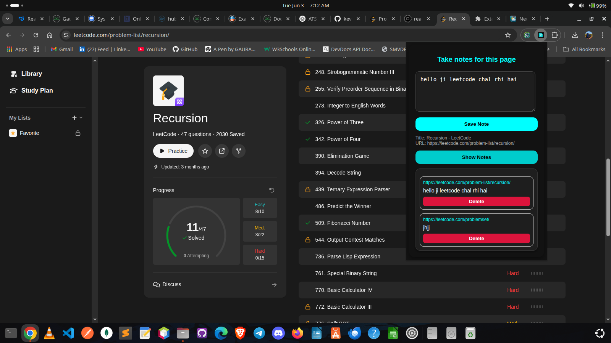
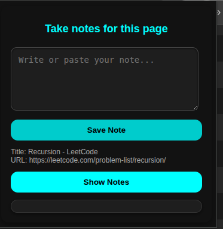

# 📝 Web Notes – Chrome Extension

**Web Notes** is a simple and powerful Chrome Extension that lets you take and save notes linked to any website or tab. Notes are saved with the website URL so you can recall them later when you revisit that page.

---

## 🌟 Features

- 🧠 Save notes from any tab or webpage
- 🔗 Notes are associated with the current website's URL
- 💾 Stored locally using Chrome's storage API
- 🧹 View, edit, and delete individual notes
- 🌓 Dark mode-friendly UI with a clean aesthetic

---

## 🖥️ Screenshots

### Popup UI

### Saved Notes View

---

## 🚀 Installation

1. Clone or download this repository.
2. Open **Chrome** and navigate to:  
   `chrome://extensions/`
3. Enable **Developer mode** (top right).
4. Click **Load unpacked**.
5. Select the folder where this extension is located.

---

## 📁 File Structure

---

## 📌 Permissions Used

- `"storage"` – To save notes locally
- `"tabs"` – To access current tab’s URL and title

---

web-notes-extension/
│
├── manifest.json # Extension configuration
├── popup.html # Main UI for popup
├── popup.js # Logic to save, retrieve, and delete notes
├── icon.png # 128x128 icon for Chrome
├── README.md # This file
└── screenshots/ # Folder for UI images
├── popup.png
└── saved_notes.png

## 📦 Upcoming Features (Ideas)

- 🔁 Sync notes across devices using `chrome.storage.sync`
- 🔍 Search/filter saved notes
- 🗂️ Group notes by domain
- ☁️ Export/import notes as JSON or TXT

---

## 🛠️ Author

Built by **[Your Name]**  
Feel free to fork, improve, and share!  

> If you like it, ⭐ the repo!

